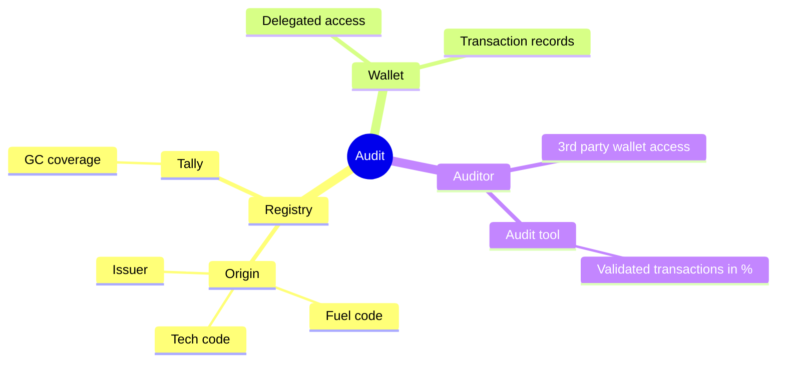
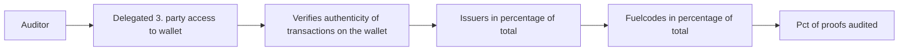

# Project Origin - Auditability

This repository contains the services and value chain clarification for enabling auditability of granular certificates, wallets, registries etc.

## Pat-Let

Granular certificates issued, based on Project Origins will be used in ESG reporting and as certification method for zero or low emission fuels production. For trust to be established and maintained, processes for verification of certificates, registries, external audit and public scrutiny must be in place. As Project Origin is maturing into use in production environments, basic functionality for audiability of a claim, wallet content or a list of granular certificates must be in place. This repository aims to create such functionality.

## Problem

In Project Origins implementation of granular certificates (GC'S), certificates is issued, claimed, slices and transfered into several registries all the while being contained in wallets controlled by owner of certificates or their agents. While a great deal of the systems relies on trust established by protocol, auditability functions is needed for claims to be trusted in processes outside of the GC issuer, registry ecosystem. 

Let's take an example of an audit:

An auditor working on ESG report audits for hourly match of electricity consumption and VE production for the company under audit. An GC service provider has established a wallet containing a power purcase agreement for company site consumption and VE productions certificates, sliced to match 24/7 for a full year. The customer controls the wallet, hence:
1. The auditor needs a delegated access to the wallet.
2. The auditor needs to verify the authenticity of certificates by matching a sample or all certificates against a relevant registry.
3. The auditor needs to varify energy amounts and match of claims to audit that this does in fact match the PPA VE production against site consumption 24/7 of the year. If checking a sample leads to no errors, thus is ususally enaugh for the auditor to sign off the reported emissions.

When using blockchain as a log for the audit process, the validation process should follow a specific set of steps to ensure accuracy and integrity. Here's how the process should behave:

1. Generate the Audit Report: The first step is to generate the audit report from the registry. This report should include all the relevant information and transactions that need to be validated.

2. Access the Blockchain: The auditor should have access to the blockchain, which serves as a decentralized and immutable ledger. The blockchain should contain all the necessary data related to the audit, including transaction records and other relevant information.

3. Verify the Audit Report: The auditor needs to compare the information in the audit report with the corresponding data on the blockchain. This step ensures that the audit report accurately reflects the transactions recorded on the blockchain.

4. Validate Transactions: The auditor should validate each transaction mentioned in the audit report by cross-referencing it with the blockchain. This validation ensures that the transactions are genuine and have not been tampered with.

5. Check Wallet 3rd Party Access: In addition to the blockchain, the auditor may also have access to a third-party wallet for validation purposes. This wallet can provide additional information about the where the proofs are published and provide the path of the merkle tree to its root and thereby make a proof-of-inclusion that verifies specific transactions on the registry.

6. Confirm Consistency: The auditor needs to confirm that the information in the audit report matches the data on the blockchain and any additional information from the third-party wallet. Any inconsistencies or discrepancies should be thoroughly investigated and resolved.

7. Document Findings: Throughout the validation process, the auditor should document their findings, including any discrepancies or issues encountered. This documentation is crucial for transparency and accountability.

By following these steps, the auditor can ensure that the audit process using blockchain as a log is thorough, accurate, and reliable. The blockchain's decentralized nature and immutability provide a high level of trust and transparency, making it an ideal tool for auditing purposes.

## Context

Important design criterias for this process is that trust in the auditor relies on hanged mans principle (e.g. loosing her right to work as an auditor), rather than actual proof. The auditor can not be expected to know Project Origin, GC standards specifics or any ways of interacting directly with registries. They will have to be introduced to a simple audit guide including audit services that. Auditors can be expected to be able to handle basic browser based services or otherwise excel sheets or CSV files. It can not be expected that an auditor has data engineers or software engineers available to help.

The only contact or in fact context provided to the auditor is what is given from the customer. Hence easy access to information and services on how to enable an auditor should be provided by a relevant party or parties in the GC ecosystem.

## Forces

## Solution
